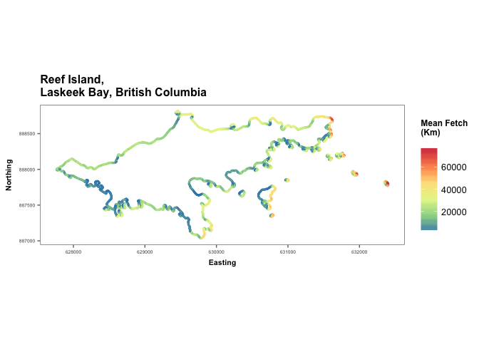

<!-- README.md is generated from README.Rmd. Please edit that file -->
[](https://travis-ci.org/sebdalgarno/HGfetch)

HGfetch
=======

Fetch-based wave exposure model.

Introduction
------------

Two methods are provided for a calculating a fetch-based wave exposure index at a set of sites: Mean Fetch and Wind-weighted Fetch. Fetch is defined as the unobstructed (i.e. by land) distance over which wind can travel across water.

These functions require three main inputs: sites (i.e. a set of coordinates), fetch data (e.g. distance of fetch lines radiating from a site at regular degree intervals), and wind data (e.g. hourly recordings of wind direction and speed over a period of time). For sites within Laskeek Bay, British Columbia, wind data (hourly recordings, Cumshewa Head 2012-2016 from <http://climate.weather.gc.ca/historical_data/search_historic_data_e.html>) and fetch data (points spaced 10m apart, fetch at 5 degree intervals) are provided within the package.

For sites within Haida Gwaii, larger fetch and wind (all stations within Haida Gwaii with available data, 2012-2016) data sets may be downloaded from <http://github.com/sebdalgarno>. For provided data, fetch distances were calculated using 1:50,000 ShoreZone vector coastline (Howes et al. 1994) and java-based software - 'Vector\_fetch' - developed by Mika Murtojarvi (Murtojarvi et al. 2007). For regions outside of Haida Gwaii, the user must provide their own fetch and wind data (in 'long' format, i.e. bearing as a single column).

Mean Fetch is calculated using the 'mean\_fetch' function, which first finds the nearest point within the fetch data set, caps the fetch distance at a user-defined maximum distance and calculates mean fetch.

Wind Fetch is calculated in the same way, except that fetch distances for each site are weighted by wind data from the nearest weather station: mean (avg. Speed \* % Frequency \* Distance, for each fetch line)

Weighting factors must first be calculated using the 'wind\_weights' function. The user has flexibility over the time period (years, months) and stations to include. The output of 'wind\_weights', along with site data and fetch data are used as inputs in the 'wind\_fetch' function.

Note that if there is concern that the nearest weather station may not be representative of conditions at a site, it can be eliminated from consideration using the 'wind\_weights' function.

References
----------

Murtojarvi, M., T. Suominen, H. Tolvanen, V. Leppanen, and O. S. Nevalainen. 2007. Quantifying distances from points to polygons: applications in determining fetch in coastal environments. Computers & Geosciences 33:843–852.

Howes, D., J. Harper, and E. Owens. 1994. Physical shore-zone mapping system for British Columbia. Resources Inventory Committee Publication 8:71.

Utilisation
-----------

``` r
library(HGfetch)
#> Loading required package: sp
library(magrittr)
library(ggplot2)
library(ggthemes)
library(RColorBrewer)
library(dplyr)
#> 
#> Attaching package: 'dplyr'
#> The following objects are masked from 'package:stats':
#> 
#>     filter, lag
#> The following objects are masked from 'package:base':
#> 
#>     intersect, setdiff, setequal, union

data <- data.frame(Long = -131, Lat = 53)
data %<>% convert_proj()

cumshewa_wind %<>% convert_proj()

laskeek_fetch %<>% convert_proj(data.x = 'Easting', data.y = 'Northing', data.CRS="+init=epsg:3005", new.CRS="+init=epsg:3005")

data %<>% nearest_point(data2 = laskeek_fetch, data2.ID = 'PointID')

data %<>% mean_fetch(fetch.data = laskeek_fetch, max.distance = 200000)

weights <- wind_weights(wind.data = cumshewa_wind, years = 2016, months = 9:4)

data %<>% wind_fetch(fetch.data = laskeek_fetch, weights.data = weights, max.distance = 200000)
```

``` r
# plot Mean Fetch and Wind-weighted Fetch results for Reef Island, Laskeek Bay, British Coluumbia
lbsites <- remove.duplicates(laskeek_fetch)

lbsites@data %<>% select(PointID)

lbsites %<>% mean_fetch(laskeek_fetch)

lbsites %<>% wind_fetch(fetch.data = laskeek_fetch, weights.data = weights)

reef <- as.data.frame(lbsites) %>% subset(Easting > 627000 & Northing < 890000)

# Mean Fetch
ggplot(reef) + geom_point(aes(x = Easting, y = Northing, color = meanfetch), size = 0.5) + coord_fixed() + 
  theme_few() + labs(color = 'Mean Fetch\n(Km)\n', title = 'Reef Island,\nLaskeek Bay, British Columbia') + 
  theme(plot.title = element_text(size = 12, face = 'bold'), axis.title = element_text(size = 8, face = 'bold'), axis.text = element_text(size = 5), legend.title = element_text(size = 9, face = 'bold')) + scale_color_distiller(palette = "Spectral")
```


``` r
# Wind Fetch
ggplot(reef) + geom_point(aes(x = Easting, y = Northing, color = windfetch), size = 0.5) + coord_fixed() + theme_few() + labs(color = 'Wind-weighted Fetch\n(Weighted Km)\n\nWind data:\nNov - Apr, 2016\n', title = 'Reef Island,\nLaskeek Bay, British Columbia') + theme(plot.title = element_text(size = 12, face = 'bold'),axis.title = element_text(size = 8, face = 'bold'), axis.text = element_text(size = 5), legend.title = element_text(size = 9, face = 'bold')) + scale_color_distiller(palette = "Spectral")
```



Installation
------------

To install from GitHub

    # install.packages("devtools")
    devtools::install_github("sebdalgarno/HGfetch")

Contribution
------------

Please report any [issues](https://github.com/sebdalgarno/HGfetch/issues).

[Pull requests](https://github.com/sebdalgarno/HGfetch/pulls) are always welcome.
